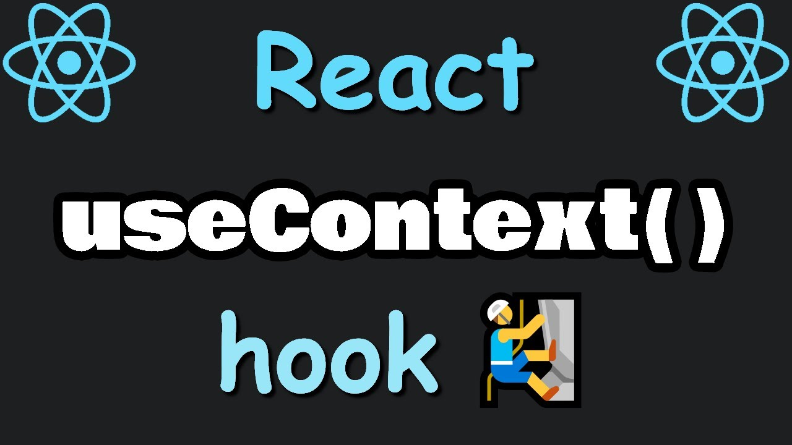
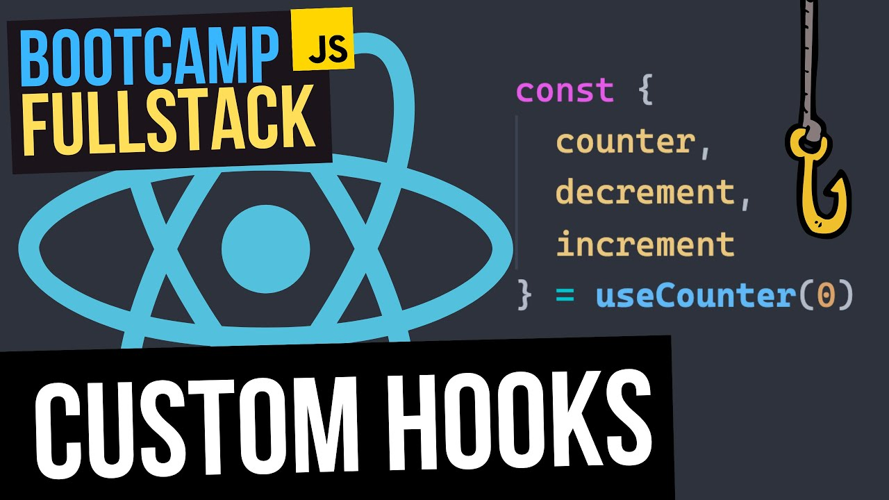

# DWEC UT06: Conceptos avanzados de React.

Existen muchos otros hooks que tienen diversas utilidades. Vamos a ver de manera resumida algunos de ellos.

## useContext

`useContext` es un hook de React que ofrece un medio para compartir datos (*contexto*) entre múltiples componentes sin pasarlos explícitamente a través de `props`, abordando así el problema conocido como **prop drilling**. Es parte de la API React Context, que está integrada en la biblioteca React.

Al utilizar `useContext`, los componentes pueden consumir valores de contexto proporcionados por un proveedor (`Provider`) que se encuentra más arriba en el árbol de componentes, lo que elimina la necesidad de pasar datos a través de componentes intermedios. Este enfoque simplifica el código y mejora la escalabilidad.

En el siguiente video teneis un ejemplo muy ilustrador de como usariamos el hook `useContext`.

<p align="center"> 
<a href="https://www.youtube.com/watch?v=FpNfvbNYPsg">

</a>
</p>

> Tenéis multitud de ejemplos en la página oficial de React. Os enlazo otro ejemplo para ver mejor su utilidad práctica. [Ejemplo de formulario](https://codesandbox.io/p/sandbox/react-dev-zjfrll?file=%2Fsrc%2FApp.js&utm_medium=sandpack).


## useReducer

Este hook  es similar al gancho `useState`. Sin embargo, es capaz de manejar una lógica más compleja con respecto a las actualizaciones de estado. Es especialmente beneficioso cuando se trata de objetos de estado que tienen múltiples propiedades o cuando las transiciones de estado dependen del estado anterior.

El hook `useReducer` toma dos argumentos: 
* una función reductora
* un valor de estado inicial. 

La función reductora especifica cómo se debe actualizar el estado en función de la acción enviada, tomando el estado actual y la acción como argumentos y devolviendo el nuevo estado. 
El valor del estado inicial representa el estado inicial del componente y puede ser un valor, objeto o matriz simple.

```jsx
const initialCount = 0

const reducer = (state, action) => {
    switch (action.type) {
        case "increment":
            return action.payload;

        case "decrement": 
            return action.payload;

        case "reset": 
            return action.payload;

        default: 
            return state;
    }
}

function Counter() {
    const [count, dispatch] = useReducer(reducer, initialCount)

    return (
    <>
      Count: {count}
      <button onClick={() => dispatch({type: "reset", payload: initialCount})}>Reset</button>
      <button onClick={() => dispatch({type: "decrement", payload: state - 1})}>Decrement</button>
      <button onClick={() => dispatch({type: "increment", payload: state + 1})}>Increment</button>
    </>
  );
}
```

En la función reductora, `action` es un objeto que tiene un parametro `type` que indica que es lo que queremos hacer dentro de la función reductora. 
Despues, recibe cualquier otra propiedad que queramos manipular en la función reductora.
La manera mas sencilla de manejar la logica que queremos llevar a cabo en la función reductora es `switch()`.

Este ejemplo tambien podria escribirse de una manera mas simplificada.

```jsx
function Counter() {
const [count, dispatch] = React.useReducer((state = 0, action) => {
    switch (action.type) {
        case "increment":
            return action.payload;

        case "decrement":
            return action.payload;

        case "reset":
            return action.payload;

        default:
            return state;
    }
}, 0)

return (
    <>
        Count: {count}
        <button onClick={() => dispatch({ type: "reset", payload: 0 })}>Reset</button>
        <button onClick={() => dispatch({ type: "decrement", payload: count - 1 })}>Decrement</button>
        <button onClick={() => dispatch({ type: "increment", payload: count + 1 })}>Increment</button>
    </>
);
}
```
<p align="center"> 
<a href="https://www.youtube.com/watch?v=BACpj7GmiEo">

</a>
</p>

> Os dejo este [articulo](https://dev.to/m0nm/usestate-vs-usereducer-what-are-they-and-when-to-use-them-2c5c) de donde esta sacado el ejemplo que hemos visto. Pero además, teneis una breve explicación de cuando utilizar `useReducer` y una comparación de un ejemplo utilizando ambos hooks.

## useCallback

El hook `useCallback` en React se usa para memorizar funciones, optimizando el rendimiento al evitar repeticiones innecesarias causadas por re-renderizados. Cuando una función se empaqueta con `useCallback`, React devolverá la misma referencia de función memorizada en renderizaciones posteriores siempre que las dependencias enumeradas en la matriz de dependencias permanezcan sin cambios.

`useCallback` toma dos argumentos: 
* la función de devolución de llamada 
* una serie de dependencias. Si alguna de las dependencias en la matriz cambia, se vuelve a crear la función de devolución de llamada; de lo contrario, se devuelve la versión almacenada en caché de la función.


```jsx
//CounterButton.jsx
const CounterButton = ({ onClick }) => {
  console.log('Rendering CounterButton');
  return <button onClick={onClick}>Click Me!</button>;
};

//App.jsx
const App = () => {
  const [count, setCount] = useState(0);

  // Define a memoized callback function using useCallback
  const handleClick = useCallback(() => {
    setCount(prevCount => prevCount + 1);
  }, []); // No dependencies, the function is created only once

  return (
    <div>
      <h1>Counter: {count}</h1>
      <CounterButton onClick={handleClick} />
    </div>
  );
};
```
## useMemo

El hook `useMemo` en React se usa para memorizar el resultado de un cálculo, optimizando el rendimiento al almacenar en caché cálculos costosos y devolver el valor almacenado en caché cuando las dependencias permanecen sin cambios.

Toma una función como primer argumento, que calcula el valor que se va a memorizar, y una serie de dependencias como segundo argumento. Cuando alguna de las dependencias cambia, se vuelve a calcular el valor memorizado.

```jsx

const fibonacci = n => {
  if (n <= 1) return n;
  return fibonacci(n - 1) + fibonacci(n - 2);
};

const App = () => {
  const [number, setNumber] = useState(20);
  const [otherState, setOtherState] = useState(false);

  // Memoize the result of the fibonacci calculation
  const fibResult = useMemo(() => fibonacci(number), [number]);

  return (
    <div>
      <h1>Calculate Fibonacci Number</h1>
      <p>Number: {number}</p>
      <p>Fibonacci Result: {fibResult}</p>
      <p>Other State: {otherState.toString()}</p>
      <button onClick={() => setNumber(prevNumber => prevNumber + 1)}>
        Increment Number
      </button>
      <button onClick={() => setOtherState(prevState => !prevState)}>
        Toggle State
      </button>
    </div>
  );
};
```

En este ejemplo, utilizamos `useMemo` para optimizar el rendimiento de un cálculo de Fibonacci dentro de un componente funcional de React. El componente gestiona un estado numérico que representa la entrada al cálculo de Fibonacci mediante el gancho `useState`. Al emplear `useMemo`, memorizamos el resultado del cálculo de Fibonacci en función del estado del número. Esto garantiza que el costoso cálculo solo se realice cuando cambia el estado del número, evitando recálculos innecesarios durante la renderización de componentes.

Cuando hacemos clic en el botón "Alternar estado", el componente de la aplicación se vuelve a representar debido a la actualización del estado de `otherState`. Sin embargo, a pesar de la nueva representación del componente, el cálculo de Fibonacci no se vuelve a calcular innecesariamente.

## Custom hooks

Los **custom hooks** en React son un tipo de función JavaScript que simula el funcionamiento de los hooks en React. Son muy útiles siempre que tengamos una lógica que se repite entre varios componentes. En estos casos, podemos sacar esta lógica y aplicarla a un **custom hook**, es decir, una función que ejecute los pasos que necesitamos de manera automática.

Al no ser funciones cualquiera, los custom hooks deben seguir una serie de reglas para ser considerados hooks y no funciones:

* La primera regla de los custom hooks en React es que su nombre debe empezar con la palabra `use`. Esta convención se crea siguiendo los hooks originales de React (`useEffect`, `useState`, `useRef`). Se considera que esto es una regla porque la comunidad ha decidido que es más sencillo reconocer un custom hook cuando sigue esta norma. Sin embargo, en teoría podrías crear uno con otro nombre. 

* Lo que realmente tienen de particular los custom hooks  es que pueden **llamar** a otros hooks. En este orden de ideas, React considera como custom hook a aquella función que dentro llama a un hook original o a otro custom hook. 

Aqui tenemos un ejemplo de `custoHook` que acepta una *URL* de API como argumento. Se utiliza `useState` y `useEffect` para manejar el estado de los datos, la carga y los errores que se presenten.

```jsx
import { useState, useEffect } from 'react';

function useApi(apiUrl) {
  const [data, setData] = useState(null);
  const [loading, setLoading] = useState(true);
  const [error, setError] = useState(null);

  const fetchData = async () => {
    try {
      const response = await fetch(apiUrl);
      if (!response.ok) {
        throw new Error('Network response was not ok');
      }
      const result = await response.json();
      setData(result);
      setLoading(false);
    } catch (error) {
      setError(error);
      setLoading(false);
    }
  };

  useEffect(() => {
    fetchData();
  }, [apiUrl]);

  return { data, loading, error };
}

export default useApi;
```
En `useEffect`, se llama a `fetchData()` La lógica de la solicitud y el manejo de errores se encuentran en la función `fetchData`, lo que hace que el código sea más claro y modular.

`ApiComponent` utiliza `useApi` para obtener y mostrar los datos de la API. Mientras se carga la solicitud, muestra un mensaje de **“Cargando…”**. Si hay un error, muestra un mensaje de error. Si la solicitud se realiza con éxito, muestra los datos obtenidos de la API.

```jsx
import useApi from '../hooks/useApi';

function ApiComponent() {
  const apiUrl = 'https://jsonplaceholder.typicode.com/todos/1';
  const { data, loading, error } = useApi(apiUrl);

  if (loading) {
    return <div>Cargando...</div>;
  }

  if (error) {
    return <div>Error: {error.message}</div>;
  }

  return (
    <div>
      <h1>Data from API</h1>
      <pre>{JSON.stringify(data, null, 2)}</pre>
    </div>
  );
}

export default ApiComponent;
```

Os dejo otro video del bueno de "Midudev" que lo explica con otro ejemplo para que lo podais entender mejor.

<p align="center"> 
<a href="https://www.youtube.com/watch?v=K4vCTeKKCkU">

</a>
</p>