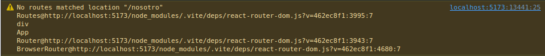
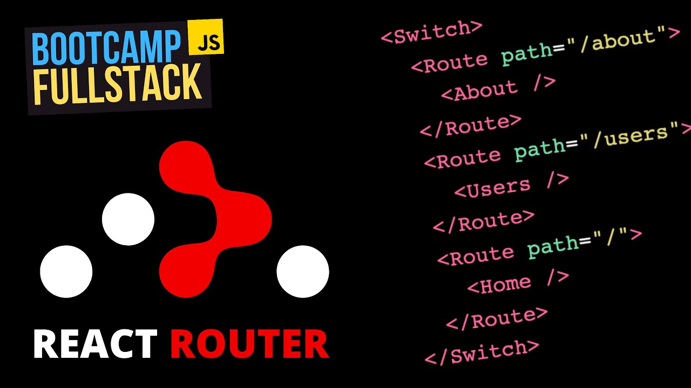
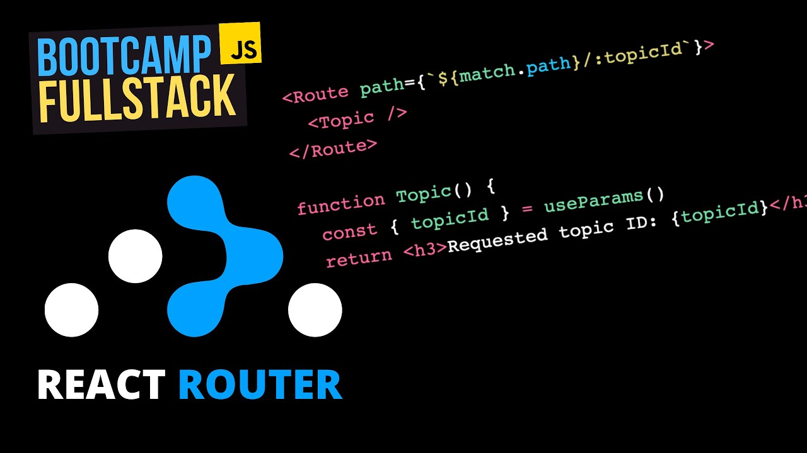

# DWEC UT06: Conceptos avanzados de React.

Necesitas entender cómo son renderizadas las páginas en una aplicación de React antes de zambullirte en el enrutamiento. Cuando pulsas un enlace en el navegador, en aplicaciones con más de una página, es enviada una petición al servidor antes de que la página HTML se muestre. 

En React, el contenido de la página es creado a partir de nuestros componentes. Así que lo que hace `ReactRouter` es interceptar la petición que se envía al servidor y luego inyectar el contenido dinámicamente desde los componentes que hemos creado. Esta es la idea general detrás de las **SPA**, que permiten que el contenido se muestre más rápido sin que la página sea actualizada.

Así que, en una aplicación de página única, cuando se navega a un nuevo componente utilizando `ReactRouter`, el archivo indice.html será reescrito en función de la lógica del componente. 

## Instalación de ReactRouter

Como toda librería de programación, `ReactRouter` funciona por medio de una serie de archivos que nos facilitan determinada acción. Esta librería en particular nos da una serie de componentes mediante los que podemos hacer la navegación por las distintas URL de nuestra aplicación de modo declarativo.

Todo lo que tienes que hacer para instalar `ReactRouter` es ejecutar el comando de instalación de la librería en la terminal de tu proyecto y esperar a que se complete la instalación. 

```node
npm install react-router-dom@6
//tambien podemos utilizar la última versión
npm install react-router-dom@latest
```

Lo primero que hay que hacer, una vez completada la instalación, es conseguir que `ReactRouter` esté disponible en cualquier parte de tu aplicación.

Para hacer esto, abre el archivo `index.jsx` de la carpeta **src**  e importa `BrowserRouter` desde `react-router-dom`, y luego, rodea el componente raíz (habitualmente `App`) con él.

Deberíamos pasar de algo asi:

```jsx
import React from 'react';
import ReactDOM from 'react-dom';
import App from './App.jsx';

ReactDOM.render (
  <React.StrictMode>
    <App />
  </React.StrictMode>,
  document.getElementById('root')
);
```

A esto otro:

```jsx
import React from 'react';
import ReactDOM from 'react-dom';
import App from './App.jsx';
import { BrowserRouter } from "react-router-dom";

ReactDOM.render (
  <BrowserRouter>
    <App />
  </BrowserRouter>,
  document.getElementById('root')
);
```

## Redigiendo a otros componentes

Vamos a crear varios componentes que nos serviran de muestra y los vamos a llamar `Inicio`, `Nosotros` y `Contacto`.

Van a ser muy sencillos ya que solo van a tener un `h1` y un texto identificativo del componente. Seguiran el patron de este ejemplo:

```jsx
function Inicio() {
  return (
    <div>
      <h1>Esta es la página de inicio</h1>
    </div>
  );
}

export default Inicio;
```
### Definición de rutas

Una vez tengamos los componentes creados, tendremos que definir las rutas. Dado que el componente `App` actúa como el componente raíz, dónde se renderiza al principio nuestro código React, vamos a crear todas nuestras rutas en él. 

Para ello importaremos las funcionalidades que emplearemos: `Routes` y `Route`. A continuación, importaremos todos los componentes a los que necesitamos proporcionar una ruta.

`Routes` actúa como contenedor padre de todas las rutas individuales que se crearán en nuestra aplicación.

`Route` se utiliza para crear una única ruta.

```jsx
import { Routes, Route } from "react-router-dom"
import Inicio from "./Inicio.jsx"
import Nosotros from "./Nosotros.jsx"
import Contacto from "./Contacto.jsx"

function Aplicacion() {
  return (
    <div className="Aplicacion">
      <Routes>
        <Route path="/" element={ <Inicio /> } />
        <Route path="/nosotros" element={ <Nosotros /> } />
        <Route path="/contacto" element={ <Contacto /> } />
      </Routes>
    </div>
  )
}

export default Aplicacion
```

`Route` recibe dos atributos:

* `path`, que especifica la ruta URL del componente deseado. Puedes llamar a esta ruta de la manera que quieras. Arriba, habrás notado que el primer nombre de ruta es raíz(`/`). Cualquier componente cuya nombre de ruta sea una barra diagonal se mostrará primero, siempre que la aplicación se cargue por vez primera. Esto implica que el componente `Inicio` será el primero en mostrarse.  
* `element`, que especifica el componente que debe renderizar el enrutador.

### Definiendo los anchors `Link`

Los elementos Link que nos proporciona `ReactRouter` sirven para usar como enlaces entre las diferentes "páginas". Son muy similares a los anchors que conocemos de HTML (`<a>`) pero con atributos diferentes.

Vamos a añadir 2 elementos `Link` para poder navegar desde la pagina del componente que se carga al principio que es `Inicio` a las otras dos páginas que tenemos, `Nosotros` y `Contacto`.

```jsx
import { Link } from "react-router-dom";

function Inicio() {
  return (
    <div>
      <h1>Esta es la página de inicio</h1>
      <Link to="/nosotros">Haz clic para ver la página NOSOTROS</Link>
      <br></br>
      <Link to="/contacto">Haz clic para ver la página de CONTACTO</Link>
    </div>
  );
}

export default Inicio;
```

Deberemos importar el elemento `Link` desde la libreria de `ReactRouter` para poder trabajar con el. Despues, ya podremos utilizarlos como se ve en el ejemplo.
Con el atributo `to=` especificaremos cual es el **path** al que queremos ir. Estos path tienen que coincidir con alguna que hemos definido en el alguna `Route` dentro de `Routes`. De lo contrario no renderizara nada y nos avisara por la consola.

<p align="center"> 

</p>

Os dejo un video donde "Midudev" explica con otro ejemplo como configurar rutas con ReactRouter.

<p align="center"> 
<a href="https://www.youtube.com/watch?v=xE7TBCR6cj0">

</a>
</p>

> En el video anterior se esta trabajando con la versión 5 de ReactRouter.
> Nosotros hemos instalado la **versión 6**. En nuestro caso no tenemos que utilizar el componente `<Switch>` ya que no hace falta porque ha sido reemplazado por el componente `<Routes>`.

## Trabajando con rutas dinamicas

Una cosa que tenemos que cubrir cuando se trata de rutas es, que naturalmente podemos crear rutas dinámicas. Esto significa rutas que no son fijas y determinadas, pero que pueden tener cualquier número de caracteres.

Las rutas dinámicas son útiles en situaciones en las que tenemos, digamos, una publicación de blog con un *slug* o *identificador* único. ¿Cómo nos aseguramos de mostrar los datos adecuados y los componentes adecuados, dado que el *slug* de nuestra publicación en el blog puede ser completamente diferente?

Para declarar un parámetro de ruta en una ruta determinada, este debe ir precedido de dos puntos `:`. Si queremos crear una ruta dinámica, `"/blog/:id"`, para un componente de publicación de blog, podría verse así:

```jsx
import React from "react";
import { BrowserRouter, Link, Routes, Route } from "react-router-dom";

export default function App() {
  return (
    <BrowserRouter>
      <Routes>
        <Route path="/" element={<Home />} />
        <Route path="/blog/:id" element={<BlogPost />} />
      </Routes>
    </BrowserRouter>
  );
}

function Home() {
  return (
    <>
    <h1>home</h1>
      <Link to="/blog/1">Post 1</Link>
      <br></br>
      <Link to="/blog/2">Post 2</Link>
    </>
  )
}

function BlogPost() {
  return (
    <>
      <h1>Blog POST</h1>
      <h2>es el numero de post X</h2>
    </>
  )
}
```

Tenemos una ruta definida para ser la primera en iniciarse que renderizaría el componente `Home`, en la cual, tenemos 2 `Link` que apuntan a 2 paginas de blog diferente (tienen diferente `id`).

La ruta que tenemos definida para estos post, apuntan al mismo componente `<BlogPost>`, es decir, que aunque estos enlaces esten funcionando correctamente (se puede observar en el navegador la URL de cada post), lo que nosotros estamos renderizando es el mismo componente todo el rato.

De hecho, si se cambia a mano el `id` del post en la URL podemos ver como sigue funcionando, aunque renderiza el mismo componente como antes.

Para acceder al parametro concreto que hemos definido en `Route`, vamos a importar `useParams` de `react-router-dom`.

```jsx
import { BrowserRouter, Link, Routes, Route, useParams } from "react-router-dom";
```

Ahora utilizaremos este hook dentro del componente `BlogPost` utilizando como referencia el nombre de parametro que hayamos definido en `Route`.

```jsx
...
<Route path="/blog/:id" element={<BlogPost />} />
...

function BlogPost() {
  const { id } = useParams()
  return (
    <>
      <h1>Blog POST</h1>
      <h2>es el numero de post {id}</h2>
    </>
  )
}
```

De esta manera ya tenemos acceso a los parametros dinamicos que se han generado en la URL y podemos renderizar lo que a nosotros nos parezca.
Podeis comprobar que cuando cambiamos la URL manualmente, ahora si se renderiza el componente con el valor que tiene en la URL.

Os dejo con otro video donde "Midudev" hace una segunda parte del video anterior y añade rutas dinamicas a su app.

<p align="center"> 
<a href="https://www.youtube.com/watch?v=yG8fx346pYQ">

</a>
</p>

